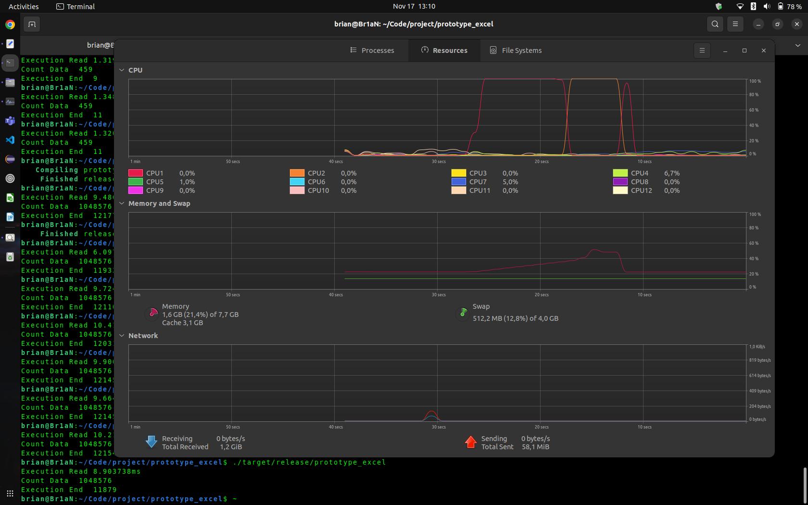
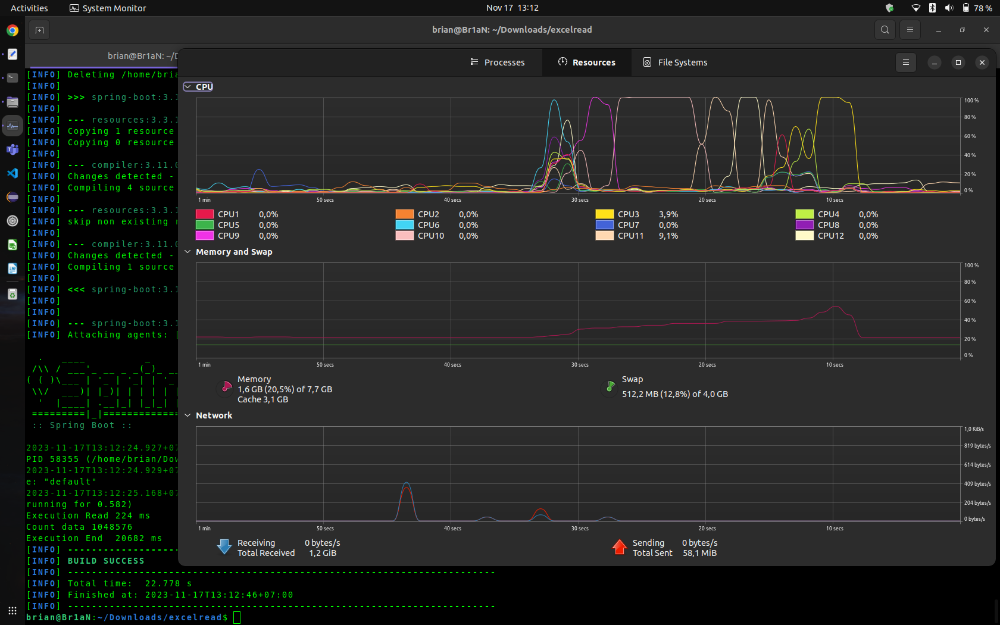

Prototype untuk read excel 

- Flow Code
  1. load file excel
  2. create variable to store data
  3. looping read all data on excel
    1. insert per row to variable data ( in no.2 )
  4. print size data
  
run project :
  - cargo run 
  - cargo build --release
    ./target/release/prototype_excel
    
you can build with release option its will optimaze proses compile 

here screencap rust running with --release 

here screencap spring-boot:run lib org.dhatim.fastexcel

performance read use file Electric_Vehicle_Population_Data2.xlsx with 1 million rows. You can copy and paste rows to make 1 million rows
look in the bottom left corner
- rust   calamine             end time is 12 seconds
- spring org.dhatim.fastexcel end time is 20 seconds

Honestly, the spring boot performance with org.dhatim.fastexcel is too good when compared to the read performance of ApachePoi and the read performance is almost comparable to the rust lib calamine
